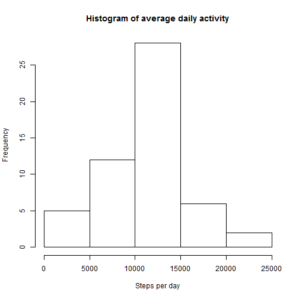
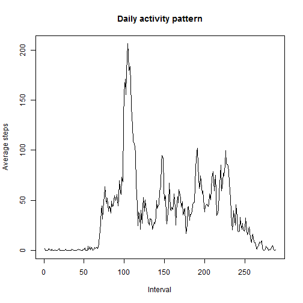
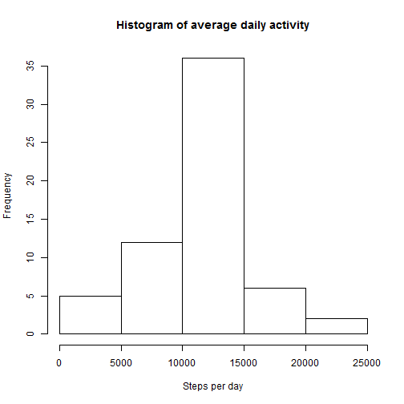
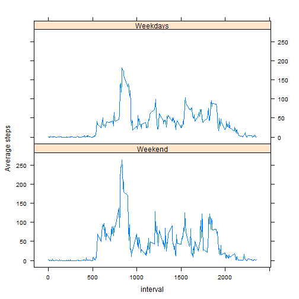

# Reproducible Research: Peer Assessment 1

This research uses data from a personal activity monitoring device. This device collects data at 5 minute intervals through out the day. The data consists of two months of data from an anonymous individual collected during the months of October and November, 2012 and include the number of steps taken in 5 minute intervals each day.

## Loading and preprocessing the data
The first step in our analysis is to load data.

```r
setwd("C:/Users/Kalvis/DataScience")
activity <- read.csv("activity.csv")
str(activity)
```

```
## 'data.frame':	17568 obs. of  3 variables:
##  $ steps   : int  NA NA NA NA NA NA NA NA NA NA ...
##  $ date    : Factor w/ 61 levels "2012-10-01","2012-10-02",..: 1 1 1 1 1 1 1 1 1 1 ...
##  $ interval: int  0 5 10 15 20 25 30 35 40 45 ...
```

Data consists of data frame with 17568 observations of  3 variables


## What is mean total number of steps taken per day?

Next step is to explore average daily activity. For this puspose we will build daily activity histogram and find mean and median of steps per day.

```r
hist(tapply(activity$steps, activity$date, sum), main = "Histogram of average daily activity", 
    xlab = "Steps per day")
```

 

```r
MeanSteps <- mean(tapply(activity$steps, activity$date, sum, na.rm = TRUE))
MedianSteps <- median(tapply(activity$steps, activity$date, sum, na.rm = TRUE))
MeanSteps
```

```
## [1] 9354
```

```r
MedianSteps
```

```
## [1] 10395
```

As it is seen on histogram most frequently between 10 and 15 thousand steps are taken per day. Mean steps per day are **9354** and median steps per day are **10395**.


## What is the average daily activity pattern?

Next we will have a look on daily activity patterns. For this purpose we will calculate and plot average number of steps taken within each interval. This should give us an insight in daily patterns.

```r
a <- tapply(activity$steps, activity$interval, mean, na.rm = TRUE)
plot(a, type = "l", main = "Daily activity pattern", xlab = "Interval", ylab = "Average steps")
```

 

```r
which.max(a)
```

```
## 835 
## 104
```

Graph shows that most highest activity is concentrated around 100th interval peeking at interval **No.104**. Peak of activity corresponds to time period between 8:40 and 8:45. There are several smaller activity peaks later in the day. Unsurprisingly activity is almost nonexistent during night hours.


## Imputing missing values

Dataset contains several missing values. We have decided to impute those values using mean values of steps taken in the same interval during other days When these values are present. Such strategy was choosen because it is likely that missing value will be similar to values in the same interval.

```r
sum(is.na(activity))
```

```
## [1] 2304
```

```r
impute <- function(x, y) {
    for (i in seq_along(x)) {
        if (is.na(x[i]) == TRUE) {
            x[i] <- mean(subset(x, y == y[i]), na.rm = TRUE)
        } else {
        }
    }
    return(x)
}
stepsImputed <- impute(activity$steps, activity$interval)
activityImputed <- activity
activityImputed$steps <- stepsImputed
hist(tapply(activityImputed$steps, activityImputed$date, sum), main = "Histogram of average daily activity", 
    xlab = "Steps per day")
```

 

```r
MeanSteps <- mean(tapply(activityImputed$steps, activityImputed$date, sum))
MedianSteps <- median(tapply(activityImputed$steps, activityImputed$date, sum))
MeanSteps
```

```
## [1] 10766
```

```r
MedianSteps
```

```
## [1] 10766
```

There are total **2304** values missing. Missing values are imputed and saved in new data frame "activityImputed" which is otherwise identical to original dataset.  

Imputed values are then plotted on histogram and although baseic shape of histogram as expected has not changed its peak is more pronounced.
Mean and median steps per day are **10766**.


## Are there differences in activity patterns between weekdays and weekends?
Next step in analysis is to compare activity patterns between weekdays and weekends. For this purpose we will create new factor variable with following factors:  
1. Weekends;  
2. Weekdays.  
After that we will plot daily activity patterns for both groups and compare results.

```r
activityImputed$day <- as.numeric(factor(weekdays(strptime(activityImputed$date, 
    format = "%Y-%m-%d"))))
days <- function(x) {
    w <- logical(length(x))
    for (i in seq(x)) {
        if (x[i] == 7) {
            w[i] <- TRUE
        } else if (x[i] == 1) {
            w[i] <- TRUE
        } else {
            w[i] <- FALSE
        }
    }
    w <- factor(w)
    levels(w) <- list(Weekend = "TRUE", Weekdays = "FALSE")
    return(w)
}
activityImputed$Day <- days(activityImputed$day)

weekends <- subset(activityImputed, activityImputed$Day == "Weekend")
weekdays <- subset(activityImputed, activityImputed$Day == "Weekdays")
b <- tapply(weekends$steps, weekends$interval, mean)
d <- tapply(weekdays$steps, weekdays$interval, mean)

par(mfrow = c(2, 1))
plot(b, type = "l", xlab = "Intervals", ylab = "Average steps", col = "red", 
    main = "Weekends")
plot(d, type = "l", xlab = "Intervals", ylab = "Average steps", main = "Weekdays", 
    col = "blue")
```

 

Plots clearly illustrate that weekend activity is higher, although follows the same pattern as weekdays. Activity peaks occur at the same time in both cases and shape of graph is similar.  

## Main conclusions.
Performed analysis allows us to make following main convlusions:  
1. Typical daily activity is around 10 000 steps.  
2. Peak activity occurs at the morning around 8:40 with other smaller activity peaks later in the day.  
3. Activity is higher in the weekend although it follows similar patterns as in weekdays.
